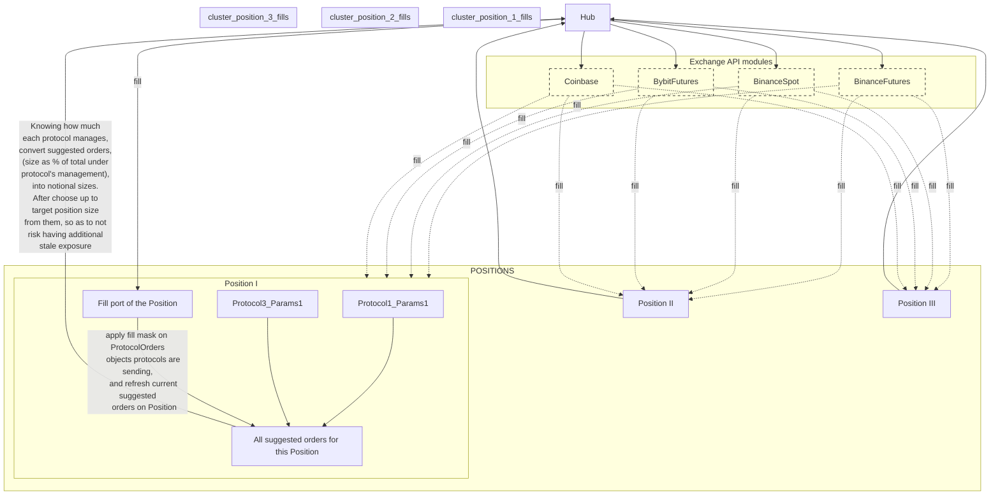

<!--TODO: add links to all Special terms I'm using here-->

# Invariants
<!--TODO: check if this section can be converted to `tracey` spec-->
## usd-based
all `Asset`s are pegged against USD only.
Lose about ~1% cases; worth it for the simplification

## exchange config consistency
all implemented (Instrument x Exchange) pairs always come with both execution and data.
This means we can have a single source of truth conf, - whatever is in the top level config

## crash-only

r[invariant.crash-only]

https://nautilustrader.io/docs/nightly/concepts/architecture/#crash-only-design

# Architecture
TODO: update the mermaid

## `top-level`
takes care of interfaces. This is the place where we integrate with site, strategy-command toml files, all and any quality of life or connector things.

## `_strategy`
operates at the level of intent compilation.
Is aware of the concept of `Position`.
Manual trading is packaged as one of the strategies[^1], - every trade is a `Position`, and it can have associated `Protocol`s. 

[^1] it's just the trader who is compiling intent for many things here.

### Strategy
Actor under [# strategy](#strategy)

TODO: expand

### instruments
strategy has 2 ways of influencing the future [Position](#position) trajectory, - direct strategy-specific intervention (eg Basket saying it's time to rebalance, or Discretionary Trader (user) is adjusting SL or TP by hand.

or defining/adjusting the set of [Protocol](#protocol)s associated with the [Position](#position). Protocols are basically mini-strategies in themselves, albeit without [Position](#position) concept. They are shared across all strategies, and can be appended onto our [Position](#position) without effecting others [^2].

[^2] except for [Control Distribution](#control-distribution)

### Outter Boundary
Strategies compile intent, meaning they manage the set of [ConceptualOrder](#ConceptualOrder)s associated with its [Position](#position), and sinks it down to [# routing](#routing)

### `protocols/`
Many protocols implement [Component](#componentshttpsnautilustraderiodocsnightlyconceptsarchitecturecomponent-state-management), when working with state that could be partially loaded. Eg: protocols that need to compile some data that is not yet available, and which (can't / shouldn't) be used while incomplete.

Q: wait, does this mean we should just make them all by default impl Component, and then skip forward to the WORKING state, for those that don't need it?
A: yes.

#### Protocol
Way to control specifics of execution of the Position they are assigned to. Think of them as additional configuration settings for the Position. Note that while Strategies control and manage [Position](#position)s, derived Protocols are subordinate to the Position that owns them. They are not aware of the world outside, and only know to propose delta changes when called upon.

Protocols analyze any kind of market information relevant to the position they are attached to, and output their suggestion of their Position's behavior as they think is appropriate for the situation. Position then gives a predefined weight to the suggestions of each protocol, and joins them with those of others before deciding on which of the suggested orders it will be passing to Hub for execution.

All available protocols are predefined, and an api for manual on-demand creation of specific protocols from common market data is not currently planned.

##### Control Distribution

## `_risk`
TODO: .

## `_routing`
operates over compiled intent.

handles 3 parts:
- generation of exact orders to express `ConceptualOrder` requested.
- routing of money between exchanges; setting correct leverage and execution mode with internal transfers
- actual execution and persistence thereof

### Conceptual Limit
TODO: .

### Invariants
TODO: transfer over into ./spec/routing.md
- input's thin waist is exclusively through `ConceptualOrder`.

- outputs **exact orders**, associated with exact exchange

- generated orders contain both {actual price, expected fee}.
  this allows us to cancel against ourselves. As our architecture allows unlimited number of delta-change processes running on the same asset. And note that most of the time if we have 2 opposite sides `ConceptualOrder`s running, their target limits will likely not touch, so if not for `expected fee`, canceling out would not even be a thing.
  

- directly takes care of executing and retrying for orders.
  If an order is not being passed, - it should determine if it's the fault of the exchange, or if something more general, and then handle it.

- `ConceptualLimit`s step in rythm with data arrival for the corresponding asset

### Communication
TODO: update to current arch \

when sending or receiving orders every actor attaches a `last_fill_key`. It must match the last key attached to the latest report to this actor by however handles execution of its requests. It's used to ensure that all client's requests are based on the up-to-date knowledge of the relevant state. By internal convention, if the client is yet to receive any reports, it sends `Uuid::default()`.

### RoutingHub
knows to set protection modes:
- HobbleMode
  small mishup eg connectivity lost or small timeout (like <2m)
- ReduceOnly
  user requested directly, or something went very wrong
- EmergencyNuke
  figures out timeframe, and then takes care of spawning necessary `ConceptualLimit` processes to fully reduce entirety of the exposure across the board
  Not meant to be encountered during normal execution

//TODO: finish

### ExchangeOrder
takes care of execution of self (most importantly keeping state in-sink with exchange).

outside communication in cases of:
- failed to execute
  timeout, network faults, 

Q: what happens when ip timeout? Do we report back to the Conceptual limit? Or do we keep at it? At what point does it become worthwhile reporting upstream?
A: synchronization with exchange state is fundamental complexity, and thus cannot be fully wrapped out through libraries. Hence, significant amount of state mngmt will be done by `ExchangeOrder` itself

HobbleMode // poor connectivity, - reject submission of new `ConceptualLimit`s

ReduceOnly // reject instantly anything that doesn't have hardcoded `reduce-only` on it (even if intention is directionally correct)

if post-only, is pre-compiled with ConceptualLimit's limit cut-off, and on rejection climbs all the way up to it.

### Updates
[RoutingHub](#routinghub) persists books for all the ongoing ConceptualLimits. Each Book takes care of updating state itself. They are spawned for the `Exchange x Instrument`s from associated `AggConfig`

every asset gets its own thread. Within it, we:
+ await computation for each `ConceptualLimit` on the asset
+ await a `tick()` on the associated book; -> repeat

async drop of conceptual limits that are finished is handled by `next()` too. Just drop if only handle's ref remains. //TODO: figure out correct way to get this behavior

## `_data`
loads data. Output boundary is not pegged to any potential input constraints.

Must be possible to run on past data, without any changes to the experience of clients using it.

most performance-critical component for my purposes. 

### arch
2 types of data this takes care of, - `continuous` and [additional](#additional)

Former is basically just [Book](#book) and associated. While latter can be any type of data, lazily requested.

### Book
fundamental primitive of the entire data module.

everything wants to have access to it, so performance is paramount.

keeps track of both exact book, and tape. Tape delta are included alongside book deltas in its in-between-snapshot cache.

Every client requests access to a number of history chunks, provided separately. Chunks are taken exactly at the snapshot boundary (rn 15m)

### additional
Primitives for accessing it are defined in this module, but all awaiting is done by clients, - these are thin wrappers.

any data recovered by any active `additional` module, is persisted to the shared Redis db.

# General Design Components
## [Components](https://nautilustrader.io/docs/nightly/concepts/architecture/#component-state-management)
is implemented for all the systems that have clear state transitions. Anything that could theoretically degrade and need to be restarted, - or even take longer to start than some other component in need of it.
Which naturally leads to `routing`, `portfolio`, (TODO: I think there are more (?)) implementing it.

## [Node]
a way to reason about objects that have hierarchical connection some others. Applies to [ConceptualLimit](#conceptual-limit)s, exact `ExchangeOrder`s, Positions, Strategies themselves.

expressed through forcing a standard for storing IDs of objects related to it

## [Position]
Main acting element at the [strategy](#strategy) level, and heavily used by [risk](#risk).

Position contains strategy's evaluation of its quality, its current size, and its expected remaining tragectory.

# Design Principles
- [Disruptors infrastructure](https://martinfowler.com/articles/lmax.html), with clear separation of _pure_ business logic (sequential in nature), from networking-bound communications for both {receiving data, communicating order execution} (asynchronous in nature)

- [Crash-only design](https://nautilustrader.io/docs/nightly/concepts/architecture/#crash-only-design)
  basically no support for working with partially corrupted state, - just crash and recover cleanly 
