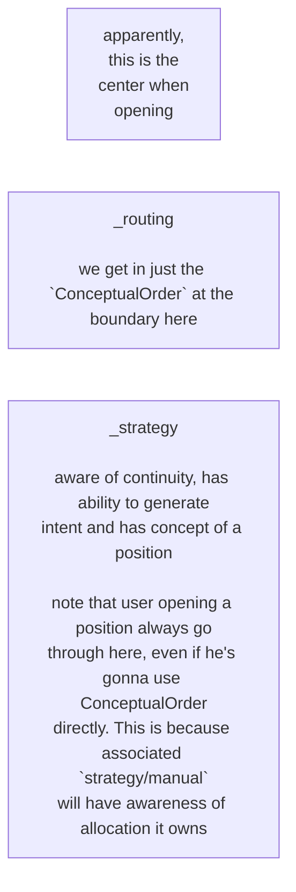

```mermaid
flowchart LR
  apparently["apparently,<br/>this is the <br/>center when<br/>opening"]
  routing["_routing<br/><br/>we get in just the `ConceptualOrder` at the boundary here"]
  strategy["_strategy<br/><br/>aware of continuity, has ability to generate<br/>intent and has concept of a position<br/><br/>note that user opening a position always go<br/>through here, even if he's gonna use ConceptualOrder<br/>directly. This is because associated `strategy/manual`<br/>will have awareness of allocation it owns"]
```
