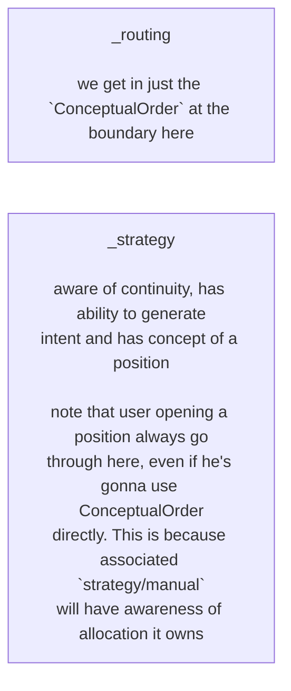

# Architecture Diagram

```mermaid
flowchart LR
  routing["_routing

we get in just the `ConceptualOrder` at the boundary here"]
  strategy["_strategy

aware of continuity, has ability to generate
intent and has concept of a position

note that user opening a position always go
through here, even if he's gonna use ConceptualOrder
directly. This is because associated `strategy/manual`
will have awareness of allocation it owns"]
```
